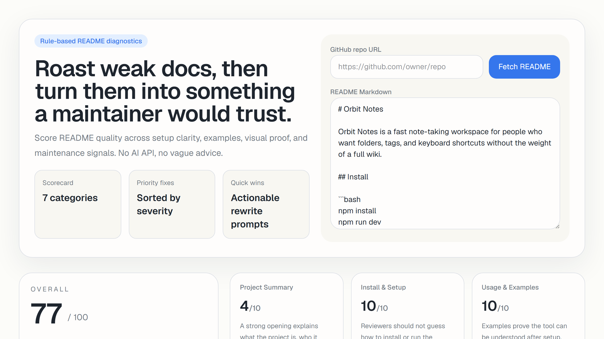

# README Roast & Fixer

README Roast & Fixer is a rule-based Next.js app that audits project documentation and highlights the gaps that make a repository feel unfinished. Paste Markdown or fetch a public GitHub README, then review a scorecard, category breakdown, and prioritized fixes.

## Screenshot



## Why it exists

Most repos lose trust in the first thirty seconds. Missing setup steps, weak examples, no screenshots, and no visible maintenance story make otherwise solid projects look abandoned. This tool gives maintainers a fast, repeatable way to review README quality before they publish, share, or hand a repo to a recruiter.

## Demo workflow

1. Paste a README or fetch one from a public GitHub repo URL.
2. Review the overall score and category breakdown.
3. Copy the generated markdown report into an issue, PR, or docs task.

## What it checks

- project summary and purpose clarity
- install and setup guidance
- usage examples and proof
- screenshots or demo links
- license visibility
- contribution and maintenance cues
- trust signals like CI or architecture notes

## Features

- Paste README Markdown and score it instantly
- Fetch a public GitHub README from a repo URL
- Score seven documentation categories
- Review prioritized fixes sorted by severity
- See strengths before you rewrite anything
- Copy an export-ready markdown report for sharing feedback

## Portfolio value

- shows product thinking around developer tooling
- uses rule-based analysis instead of hand-wavy AI output
- includes issue templates, CI, changelog, release flow, and follow-up PR history

## Tech Stack

- Next.js 16 App Router
- React 19
- TypeScript
- Tailwind CSS 4
- Vitest

## Getting Started

```bash
npm install
npm run dev
```

Open `http://localhost:3000`.

## Verification

```bash
npm run test
npm run lint
npm run typecheck
npm run build
```

## Roadmap

See `docs/ROADMAP.md`.

## Contributing

Contributions are welcome. For meaningful scoring-rule changes, open an issue first so the rubric stays intentional and easy to reason about.

## Release

See `docs/RELEASE_CHECKLIST.md`.

## License

MIT
